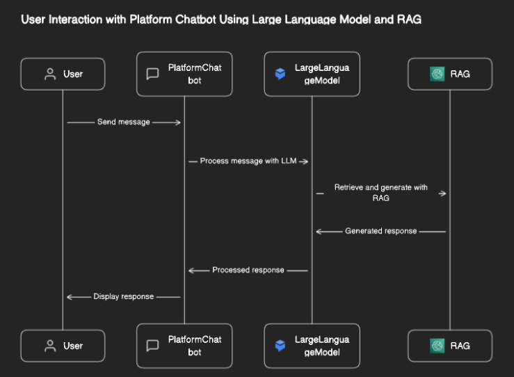

#### Team Name - Meraki
#### Problem Statement - Generative AI Large Language Models Fine Tuned For Legal Practice Platform
#### Team Leader Email - prajnac20@gmail.com

## A Brief of the Prototype:

Our Chatbot is a cutting-edge tool designed to empower legal practitioners by providing in-depth analysis and comprehensive insights into legal cases. Tailored specifically for the legal profession, this chatbot offers a seamless and efficient way for legal professionals to navigate through complex cases, aiding them in making informed decisions and formulating effective strategies.

### Key Features:

#### Case Summarization:
Chatbot excels in summarizing extensive case materials, extracting key details, and presenting a concise overview. This feature enables legal practitioners to quickly grasp the essential elements of a case, saving valuable time in the research process.
#### Legal Research Assistance:
The chatbot integrates advanced legal research capabilities, allowing practitioners to access relevant statutes, case law, and legal precedents. By leveraging natural language processing,   Chatbot simplifies the research process, making it more accessible for legal professionals.
#### Analysis of Legal Documents:
Legal documents can be overwhelming, but the chatbot excels in analyzing and interpreting legal language. It identifies critical clauses, potential risks, and noteworthy arguments within documents, enabling practitioners to delve into the nuances of each case effortlessly.
#### Customized Case Strategy Recommendations:
Based on the information provided and the intricacies of a case, the chatbot generates personalized recommendations for legal strategies. It takes into account relevant legal precedents, current regulations, and the unique aspects of each case, assisting practitioners in developing robust and tailored legal approaches.
#### Interactive Q&A Sessions:
This Chatbot engages in interactive question-and-answer sessions, allowing practitioners to seek clarification on specific legal points, precedents, or procedural matters. This interactive feature promotes a dynamic exchange of information and enhances the depth of understanding.

#### Collaborative Case Management:
The chatbot seamlessly integrates with case management systems, facilitating collaboration among legal teams. It streamlines communication, document sharing, and task allocation, fostering an efficient and organized approach to case handling.

#### Tech Stack:

Python frameworks - Langchain and Haystack.
In the current version the usage of langchain is done do the candidate document retrieval from the document set using FAISS, that is to be replaced Intel OneAPI AI Analytics.

### Step-by-Step Code Execution Instructions:
Step 1: Open my_pipeline.py
Step 2: In PromptNode provide path for the llm or provide the API Key.
Step 3: run the command streamlit run bot.py

### Future Scope:

The future scope of your bot can be broad and depends on your specific goals, the domain it operates in, and the evolving needs of users. Here are some potential directions for expanding the capabilities and enhancing the functionality of the bot:

#### Natural Language Processing (NLP) Enhancements:
Invest in improving the bot's NLP capabilities to enhance its understanding of complex legal language, user queries, and context. This could involve integrating more advanced NLP models or fine-tuning existing ones.

#### Case Prediction and Analytics:
Integrate machine learning algorithms to enable the bot to predict case outcomes based on historical data and legal precedents. Provide analytics and insights into potential legal strategies based on the analysis of similar cases.

#### Dynamic Legal Research:
Expand the bot's legal research capabilities by integrating with legal databases, academic journals, and real-time legislative updates. Enable the bot to provide up-to-date information on changes in laws and regulations.

#### Multilingual Support:
Extend the bot's language capabilities to support multiple languages, making it accessible to a broader audience. This could involve language translation features and cross-cultural legal insights.

#### Voice and Chat Interface:
Implement voice recognition and interaction capabilities, allowing users to communicate with the bot through voice commands. Enhance the chat interface to support more interactive and dynamic conversations.

#### Integration with Legal Systems:
Integrate the bot with legal case management systems, document repositories, and other tools commonly used by legal practitioners. This ensures a seamless workflow and improves collaboration within legal teams.

#### Legal Compliance Checker:
Develop a feature that checks legal documents for compliance with specific laws and regulations. Provide suggestions for modifications to ensure compliance and reduce legal risks.

#### User Authentication and Authorization:
Implement secure user authentication and authorization mechanisms, especially if dealing with sensitive legal information. Ensure that the bot complies with data protection and privacy regulations.

#### Continuous Learning and Feedback Mechanism:
Incorporate a feedback loop to allow users to provide input on the bot's responses. Use this feedback to continuously improve the bot's accuracy and relevance.

#### Expand to Other Legal Domains:
Consider expanding the bot's capabilities to cover a broader range of legal domains (e.g., family law, intellectual property, corporate law) to cater to a diverse user base.

